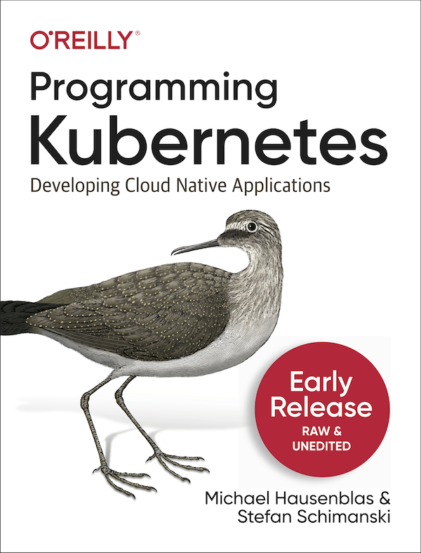

In this book, [Michael Hausenblas](https://twitter.com/mhausenblas) and [Stefan Schimanski](https://twitter.com/the_sttts)  teach you how to develop cloud native apps with the Kubernetes API. We cover everything from custom resources to `client-go` to operators to custom API servers and cloud native programming languages. A solid understanding of Kubernetes and familiarity with the Go programming language are required to benefit from this book.

Currently available:

* The [full table of contents](https://mhausenblas.info/pk8s/toc.pdf) as of mid April 2019
* The Go code examples used in the book:
  * [cnat](https://github.com/programming-kubernetes/cnat): example custom controller & resources (Operator SDK/ Kubebuilder)
  * [pizza-crd](https://github.com/programming-kubernetes/pizza-crd): example custom resource with conversion and admission webhooks
  * [custom-apiserver](https://github.com/programming-kubernetes/custom-apiserver): example custom API server

UPDATE April 2019: check out the [Early Release](https://learning.oreilly.com/library/view/programming-kubernetes/9781492047094/) available via O'Reilly Safari:

